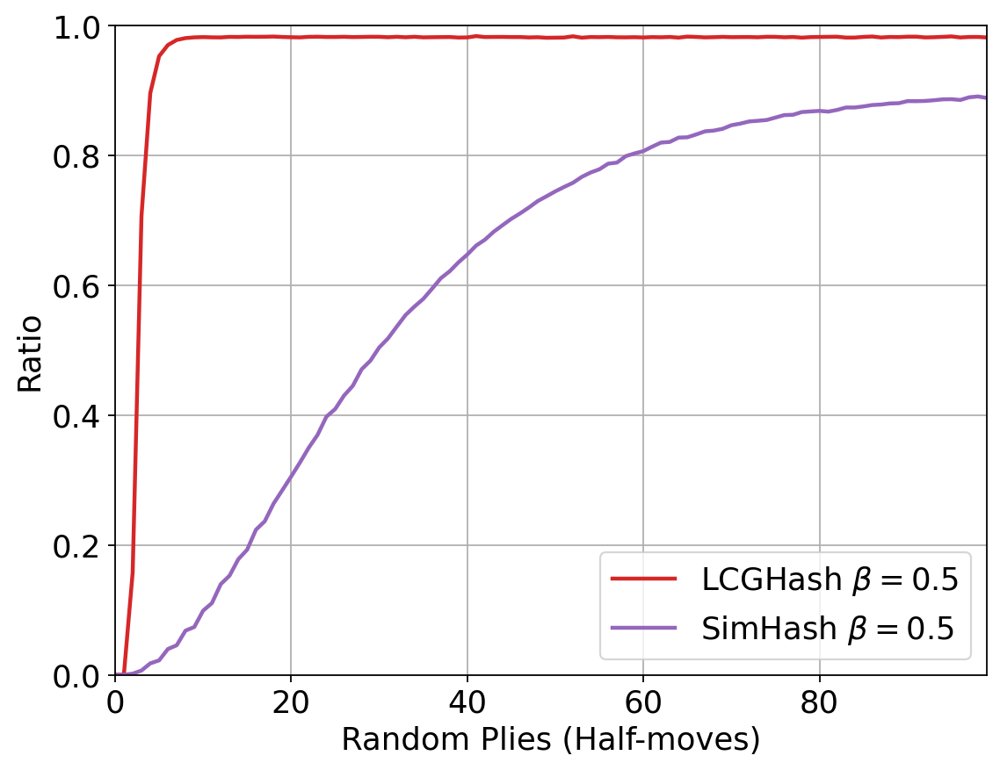
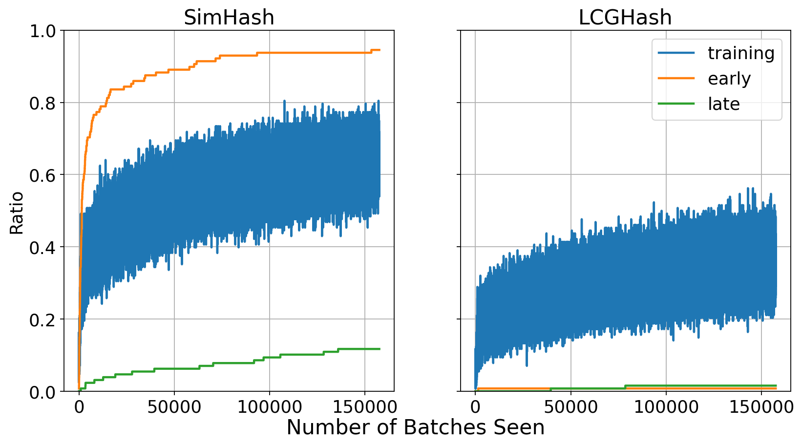
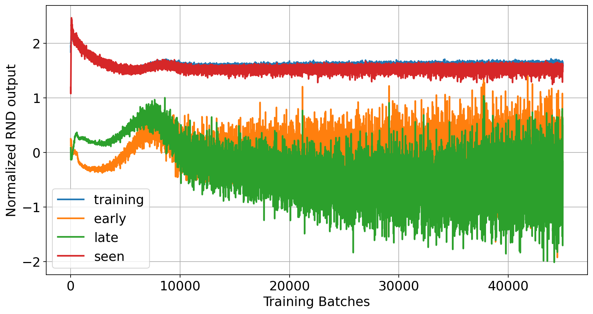

# takzero

An implementation of AlphaZero for the board game Tak.
TakZero is arguably one of the strongest engines in Tak along with [Topaz](https://github.com/Jakur/topaz-tak).
For the network weights reach out to me directly.

This is my second time implementing AlphaZero for Tak. My first was [WilemBot](https://github.com/ViliamVadocz/tak).

This repository is a bit of a mess because I wrote it during my Bachelor's thesis, so there is a lot of experimental and unused code.
If you wish to use the engine, you only have to build the `tei` binary (i.e. only run `cargo build --release -p tei`).

# Structure

The repository contains several libraries and binaries:
- `takzero` is the main library which implements MCTS and the neural networks
- `selfplay` is used during training to generate replays and exploitation targets
- `reanalyze` computes fresh targets from old replays
- `learn` takes targets from `selfplay` and `reanalyze` to train new models
- `evaluation` pits models against each other
- `puzzle` runs the puzzle benchmark
- `analysis` includes interactive game analysis
- `graph` computes the ratio of unique states seen throughout training
- `tei` a [TEI](https://github.com/MortenLohne/racetrack#tei) implementation
- `eee` is a collection of binaries to run Epistemic uncertainty Estimation Experiments (EEE)
    - `generalization` trains a hash-based uncertainty estimator
    - `rnd` is the same as `generalization`, but specifically for `rnd`
    - `seen_ratio` analyzes the ratio of seen states according to a filled hash-set
    - `ensemble` trains an ensemble network
    - `utils` utility functions for running experiments
- `visualize_search` creates a visualization of the search tree used by an agent
- `visualize_replay_buffer` creates a visualization of the overlap of different replay buffers,
    as well as the number of seen states at different depths
- `python` contains miscellaneous Python scripts
    - `action_space` computes the action space for different board sizes
    - `analyze_search` analyzes search data to figure out which bandit algorithm optimizes best for exploration
    - `elo` computes Bayesian Elo from match results (from `evaluation`) and creates a graph
    - `extract_from_logs` graphs various data from logs
    - `concat_out` concatenates log output
    - `generate_openings` generates random opening positions (for example to use as an opening book for a tournament)
    - `get_match_results` extract match results from evaluation logs
    - `improved_policy` compares different improved policy formulas
    - `novelty_per_depth` plots the novelty per depth
    - `plot_eee` plots the results of EEE
    - `plot_elo_data` plots the Elo data
    - `replay_buffer_uniqueness` plots the replay buffer uniqueness

# Building

## LibTorch

You will need the C++ Pytorch library (LibTorch).
See [tch-rs](https://github.com/LaurentMazare/tch-rs#getting-started)
for installation instructions.

It's very likely that a newer version of LibTorch has been released
since I have updated the repository last. My recommendation is to
download the newest and update the `tch-rs` version in `Cargo.toml`
to match.

### Environment Variables

Make sure to set the following environment variables (This assumes Linux):
```bash
export LIBTORCH=/absolute/path/to/your/libtorch
export LIBTORCH_INCLUDE=$LIBTORCH
export LD_LIBRARY_PATH=$LIBTORCH/lib:$LD_LIBRARY_PATH
export LD_PRELOAD=$LIBTORCH/lib/libtorch_cpu.so:$LIBTORCH/lib/libtorch.so
```

You may also need to set `LIBTORCH_BYPASS_VERSION_CHECK` to `1` if the latest
`tch-rs` version is a little behind your version of LibTorch.

## Raspberry Pi

I managed to build this repository on my Raspberry Pi. Here are the steps I followed:

1. [install `uv`](https://docs.astral.sh/uv/getting-started/installation/) and run `uv init` to setup an environment
2. `uv add torch numpy setuptools` to add the required dependencies
3. `source .venv/bin/activate` to activate the virtual environment
4. [install `rustup`](https://rust-lang.org/tools/install/) and get the default toolchain for your system
5. `git clone` this repository
6. update `tch-rs` in `Cargo.toml` to the latest version
7. [install the mold linker](https://github.com/rui314/mold) so that I can link on ARM
8. add a `.cargo/config.toml` with
```toml
[target.aarch64-unknown-linux-gnu]
linker = "/usr/bin/clang"
rustflags = ["-C", "link-arg=--ld-path=/usr/bin/mold", "-C", "target-cpu=native"]
```
9. export a bunch of environment variables (put this in your .bashrc or similar)
```bash
export LIBTORCH_USE_PYTORCH=1
export LIBTORCH_BYPASS_VERSION_CHECK=1
export LIBTORCH=~/.venv/lib/python3.10/site-packages/torch   # Replace with your own path to torch that was installed by uv
export LIBTORCH_INCLUDE=$LIBTORCH
export LD_LIBRARY_PATH=$LIBTORCH/lib:$LD_LIBRARY_PATH
export LD_PRELOAD=$LIBTORCH/lib/libtorch_cpu.so:$LIBTORCH/lib/libtorch.so
```
10. `cargo build --release -p tei`
11. wait like 15 minutes for it to build

# Reproducing the Plots



To generate the local novelty per depth graph follow these steps:
1. Edit `eee/src/seen_ratio.rs` with the path to a trained model, and adjust the imports based on whether it is a SimHash or LCGHash model.
2. Run `cargo run -p eee -r --bin seen_ratio` for each agent.
3. Take the output and place it into `python/novelty_per_depth.py`.
4. Run `python python/novelty_per_depth.py`.



1. Acquire a replay buffer by running an undirected agent. (See elo graph instructions.)
2. Edit the import in `eee/src/generalization.rs` for the model that you want to test.
3. Run `cargo run -p eee -r --bin generalization` for each agent, rename the output file `eee_data.csv` for each.
4. Edit `plot_eee.py` to plot hashes and run `python python/plot_eee.py`



1. Acquire a replay buffer by running an undirected agent. (See elo graph instructions.)
2. Run `cargo run -p eee -r --bin rnd`
3. Edit `plot_eee.py` to plot RND and run `python python/plot_eee.py`


To generate the elo ratings for agents throughout training follow these steps:
1. Edit `selfplay/src/main.rs`, `reanalyze/src/main.rs`, and `learn/src/main.rs` for the agent and value of beta that is desired.
2. Compile using `cargo build -r -p selfplay -p reanalyze -p learn`. If exploration is desired, append `--features exploration` to the command.
3. Deploy the agent on a cluster, 1 learn process, 10 selfplay processes, and 10 reanalyze processes.
4. Once you have generated checkpoints for all agents, compile the evaluation using `cargo build -r -p evaluation`.
5. Evaluate agents against each other by deploying evaluation processes.
6. Extract the match results out of logs using `python/get_match_results.py`.
7. Place the match results into `match_results/` and run `python python/elo.py` to plot the elo.
8. For an easier to edit plot, copy the bayeselo output from `elo.py` into `plot_elo_data.py` in the expected format. 


To generate the replay uniqueness graphs follow these steps:
1. Train agents using steps 1-3 from the elo graph instructions.
2. Edit `graph/main.rs` with paths to the replay files.
3. Run `cargo run -r -p graph` and see the generated graph in `graph.html`.
4. For an easier to edit plot, copy the output into `replay_buffer_uniqueness.py`
    and run with `python python/replay_buffer_uniqueness.py`.
